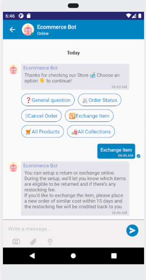

[Kommunicate](https://www.kommunicate.io/?utm_source=github&utm_medium=readme&utm_campaign=ios) iOS Sample App in Objective-C

An Open Source iOS Live Chat SDK for Customer Support.

## Overview

Kommunicate provides open source live chat SDK in iOS. The Kommunicate SDK is flexible, lightweight and easily integrable. It lets you easily add real time live chat and in-app messaging in your mobile applications and websites for customer support. The SDK is equipped with advance messaging options such as sending attachments, sharing location and rich messaging.

To get started with Kommunicate iOS SDK, head over to Kommunicate website and Signup to get your Application ID.

## Example

To run the example project, clone the repo, and run pod install.

# How to Run the Project

## Follow these steps to run the project:

- Get Your App ID:
    Start by obtaining the appid from the dashboard.
- Open the Project in Xcode:
    Launch Xcode and open the project you want to work on.
- Navigate to viewController.m:
    Locate and open the viewController.m file within your project.
- Configure User and App Information:
    In the viewController.m file, find the following lines:
        `NSString *userId = @"<pass a user Id>";`
        `NSString *applicationId = @"<pass your App ID>";`
    Replace <pass a user Id> with the desired user ID and <pass your App ID> with your actual App ID.
- Build the Project:
    Finally, build the project.

## Requirements

- iOS 13+
- Xcode 12+

## Docs

Please checkout [Documentation](https://docs.kommunicate.io/docs/ios-authentication.html) for more details.

## License

Kommunicate is available under the BSD-3-Clause license. See the LICENSE file for more info.
